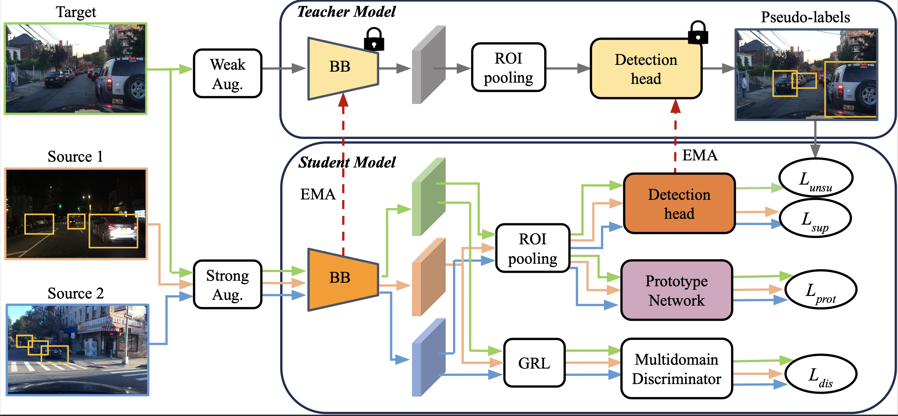
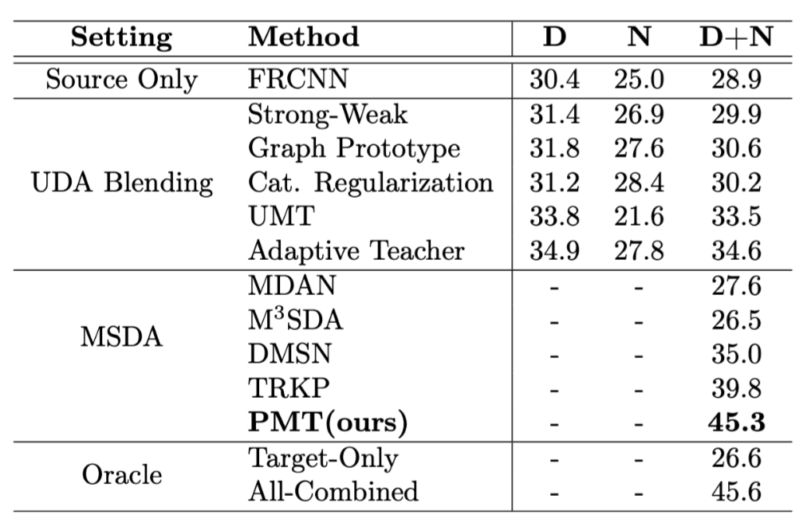
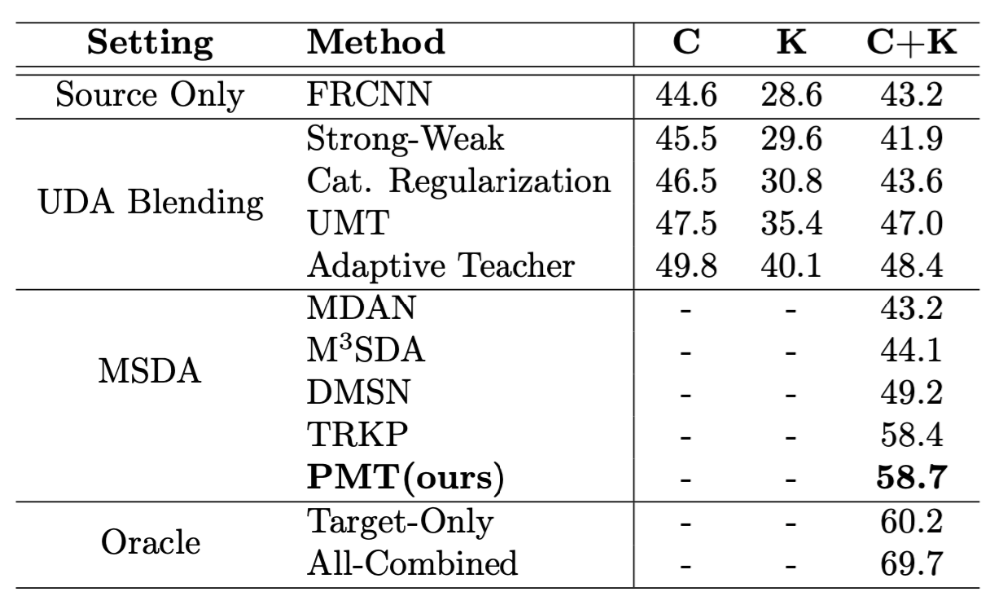

# Multi-Source Domain Adaptation for Object Detection with Prototype-based Mean-teacher

This is the Pytorch implementation of our paper - <br>

**Multi-Source Domain Adaptation for Object Detection with Prototype-based Mean-teacher**<br>
Atif Belal, Akhil Meethal, Francisco Perdigon Romero, Marco Pedersoli, Eric Granger
[[arXiv]()] 


<p align="center">

</p>

# Installation

## Prerequisites

- Linux or macOS with Python ≥ 3.8
- PyTorch ≥ 1.5 and torchvision that matches the PyTorch installation.
- Detectron2


## Create Python environment and Install PyTorch

```shell
mkdir python_env
python3 -m venv python_env/
source python_env/bin/activate
pip3 install torch torchvision torchaudio
```

## Build Detectron2 from Source

Follow the [INSTALL.md](https://github.com/facebookresearch/detectron2/blob/master/INSTALL.md) to install Detectron2.

## Dataset download

1. Download the datasets

BDD100K - Download the dataset from [BDD100K page](https://bdd-data.berkeley.edu)

Cityscapes - Follow the instruction on [DA-Faster-RCNN](https://github.com/yuhuayc/da-faster-rcnn/tree/master/prepare_data)

Kitty - Download the dataset from [Kitty](https://www.cvlibs.net/datasets/kitti/eval_object.php?obj_benchmark=2d)

MS COCO - Download the dataset from [COCO](https://cocodataset.org/#download)

Synscapes - Follow the instruction on [Synscapes](https://synscapes.on.liu.se/download.html)


2. Organize the dataset as following:

```shell
PMTeacher/
└── datasets/
    └── Daytime/
        ├── Annotations/
        ├── Imagesets/
        ├── JPEGImages.json

  └── Night/
          ├── Annotations/
          ├── Imagesets/
          ├── JPEGImages.json
  └── DuskDawn/
        ├── Annotations/
        ├── Imagesets/
        ├── JPEGImages.json
  └── Kitty/
        ├── Annotations/
        ├── Imagesets/
        ├── JPEGImages.json
  └── Cityscapes/
        ├── annotations/
        ├── gtFine/
        ├── leftIm8bits
  └── Synscapes/
        ├── img/
        ├── meta/
  └── Coco/
        ├── annotations/
        ├── train2017/
```

## Training

 Train the PMT under Daytime, Night (source) and DuskDawn (target)

```shell
python train_net.py \
      --num-gpus 4 \
      --config configs/crosstime.yaml \
      OUTPUT_DIR output/crosstime
```
Train the PMT under Cityscapes, Kitty (source) and Daytime (target)

```shell
python train_net.py \
      --num-gpus 4 \
      --config configs/crosscamera.yaml \
      OUTPUT_DIR output/crosscamera
```

## Resume Training

```shell
python train_net.py \
      --resume \
      --num-gpus 4 \
      --config configs/crosstime.yaml \
      MODEL.WEIGHTS <your weight>.pth
```

## Evaluation

```shell
python train_net.py \
      --eval-only \
      --num-gpus 4 \
      --config configs/crosstime.yaml \
      MODEL.WEIGHTS <your weight>.pth
```

## Pre-trained Models
Crosstime Setting - Model()
Crosscamera Setting - Model()


## Result comparison on the Crosstime Setting
<p align="center">

</p>

## Result comparison on the Crosscamera Setting
<p align="center">

</p>

